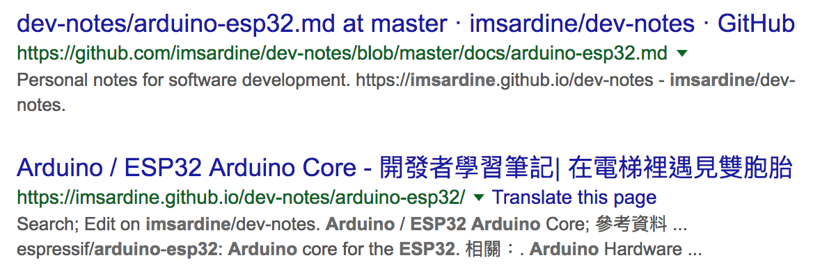

# [GitHub](github.md) / Pages

  - [GitHub Pages \| Websites for you and your projects, hosted directly from your GitHub repository\. Just edit, push, and your changes are live\.](https://pages.github.com/)
      - Websites for you and your projects. Hosted directly from your GitHub repository. Just edit, push, and your changes are live.
      - You get one site per GitHub account and organization, and unlimited project sites. 分為 3 種 user/organization 及 project
  - [What is GitHub Pages? \- User Documentation](https://help.github.com/articles/what-is-github-pages/)
      - GitHub Pages is a STATIC SITE HOSTING SERVICE designed to host your personal, organization, or project pages directly from a GitHub repository.
      - GitHub Pages is a static site hosting service and doesn't support server-side code such as, PHP, Ruby, or Python.

## Usage Limits ??

  - [Usage Limits - What is GitHub Pages? \- User Documentation](https://help.github.com/articles/what-is-github-pages/#usage-limits) #ril
  - [GitHub Terms of Service \- User Documentation](https://help.github.com/articles/github-terms-of-service/) #ril

## 新手上路 ?? {: #getting-started }

  - [Creating Project Pages using the command line \- User Documentation](https://help.github.com/articles/creating-project-pages-using-the-command-line/) #ril

## User, Organization, Project Pages ??

  - 由於 user/organization site 的 `master` branch 被拿去做為網頁的內容，可以考慮將 source 放在 `source` branch；再者 `master` master 的 history 根本不重要。

參考資料：

  - [GitHub Pages \| Websites for you and your projects, hosted directly from your GitHub repository\. Just edit, push, and your changes are live\.](https://pages.github.com/)
      - User site 跟 organization site 的做法相同；先建立名為 `NAME.github.io` 的 repo，其中 `NAME` 可以是 username 或是 organization name，再把內容寫在 `master` branch，就可以在 https://<username>.github.io 或 https://<orgname>.github.io 看到內容。
      - Project site 要在 Settings > GitHub Pages 選定網站內容來自哪個 branch，預設是 None，可以選擇 `master` branch 或 `master branch /docs folder`，然後就可以在 https://<username>.github.io/<projectname> 或 https://<orgname>.github.io/<projectname> 看到內容；這裡完全沒提到 `gh-pages` branch。
  - [Configuring a publishing source for GitHub Pages \- User Documentation](https://help.github.com/articles/configuring-a-publishing-source-for-github-pages/)
      - 就 user page 跟 organiation page 而言，repository 一定是 `<username>.github.io` 或 `<orgname>.github.io`，而且內容只能來自 `master` branch。
      - Project page 的內容來源就比較多選擇，可以是 `master`、`gh-pages` branch，或是 `master` branch 下的 `/docs` 子資料夾。
      - Default source settings for repositories without the username naming scheme 應該是呼應下面 "not follow the repository naming scheme <username>.github.io or <orgname>.github.io" 的說法，種情況下才會有 `master` 或 `gh-pages` 的選擇；當然 `gh-pages` branch 的選項要 repo 裡有這個 branch 時才會出現，不過 `master` branch 與 `master` branch /docs folder 這兩個選項固定存在 (能不能選是一回事)
  - [User, Organization, and Project Pages \- User Documentation](https://help.github.com/articles/user-organization-and-project-pages/)
      - Site 被歸為 2 類 project pages site 或 user/organization pages site，兩者間有些微的差異；主要是內容的來源。
      - Project pages site 附加在某個 project 下，所以內容來自同一個 repo 的 branch，但 user/organization pages site 有自己的 repo，所以只能來自 `master` branch。
      - If the URL for your GitHub Pages site contains a username or organization name that begins or ends in a dash, or contains consecutive dashes, then people browsing with Linux will receive a server error when they visit the site. 感覺是 hostname 不能以 `-` 開頭或結尾，也不能有連續的 `-`?
  - [Simpler GitHub Pages publishing \| The GitHub Blog](https://blog.github.com/2016-08-17-simpler-github-pages-publishing/) (2016-08-17)
      - 當 repository 專用於 website content 時用 `master` branch，而 `docs/` 資料夾的用法，則可以讓 code 跟 documentation 維護在同一個 branch 裡，好處是一個 PR 可以同時包含 code 與 documentation 的修改。
      - 不過上述 `docs/` 的好處，只適合搭配 GitHub 內建的 generator (Jekyll) -- publish from the `/docs` folder，若要用其他方式產生網站內容，就得採用同一 repository 的 `gh-pages` branch 或是另一個 repository 的 `master` branch。
  - [Unpublishing a User Pages site \- User Documentation](https://help.github.com/articles/unpublishing-a-user-pages-site/) 由於 user/organization site 的內容來自 `master` branch，所以把 `master` branch 刪除，或是將 repository (`<username>`.github.io`) 刪除；猜想將 repository 更名也可以?
  - [Unpublishing a Project Pages site \- User Documentation](https://help.github.com/articles/unpublishing-a-project-pages-site/) 把 `gh-pages`/`master` branch 刪除即可 #ril

## Build ??

  - [Building User and Organization Pages sites - User, Organization, and Project Pages \- User Documentation](https://help.github.com/articles/user-organization-and-project-pages/#building-user-and-organization-pages-sites)
      - 這裡的 build 指的是產生內容並推回 repo? 上面的 Building Project Pages sites 沒提到如何自動化??
      - User Pages sites 提到 They can also use DEPLOY KEYS to automate the process.
      - Organization Pages sites 提到 To automate builds, you can set up a MACHINE USER as a member of your organization. ... Deploy keys aren't supported for Organization Pages sites.

## Custom Domain ??

  - [Quick start: Setting up a custom domain \- User Documentation](https://help.github.com/articles/quick-start-setting-up-a-custom-domain/) #ril
  - [Using a custom domain with your Project Pages site - User, Organization, and Project Pages \- User Documentation](https://help.github.com/articles/user-organization-and-project-pages/#using-a-custom-domain-with-your-project-pages-site) 一樣分 user/organization site 與 project site 來看
      - User/organization site 採用 custom domain 後，也可以在  -- the custom domain REPLACES username.github.io in the URL for all Project Pages sites hosted under that account.
      - Project Pages sites that use a custom domain are ALSO AVAILABLE at `username.github.io/projectname` for personal accounts, and `orgname.github.io/projectname` for organizations. 是指採用 custom domain 後，在 https://xxx.github.io/<projectname> 還是看得到內容?
  - [Faster, More Awesome GitHub Pages \| The GitHub Blog](https://blog.github.com/2014-01-07-faster-more-awesome-github-pages/) (2014-01-07) #ril
  - [Using a custom domain with GitHub Pages \- User Documentation](https://help.github.com/articles/using-a-custom-domain-with-github-pages/) #ril
  - [What is GitHub Pages? \- User Documentation](https://help.github.com/articles/what-is-github-pages/#guidelines-for-using-github-pages) 提到 2016-07-15 採用 `github.io` domain 的 site 走 HTTPS，但在之前的 site 要另外啟用 HTTPS。
  - [Securing your GitHub Pages site with HTTPS \- User Documentation](https://help.github.com/articles/securing-your-github-pages-site-with-https/) #ril
  - [Using a custom domain with GitHub Pages \- User Documentation](https://help.github.com/articles/using-a-custom-domain-with-github-pages/) #ril
  - [Custom domain redirects for GitHub Pages sites \- User Documentation](https://help.github.com/articles/custom-domain-redirects-for-github-pages-sites/) #ril
  - [Troubleshooting custom domains \- User Documentation](https://help.github.com/articles/troubleshooting-custom-domains/) #ril

## Custom 404 Page ??

  - [Creating a custom 404 page for your GitHub Pages site \- User Documentation](https://help.github.com/articles/creating-a-custom-404-page-for-your-github-pages-site/) #ril

## Cache ??

  - [javascript \- Determining a page is outdated on github pages \- Stack Overflow](https://stackoverflow.com/questions/12556593/) 提供的靜態網頁有 cache 時間過長的問題? #ril

## Google Ads ??

  - Can I put Google Adsense Ads on a website hosted on GitHub Pages? - Quora https://www.quora.com/Can-I-put-Google-Adsense-Ads-on-a-website-hosted-on-GitHub-Pages Matt Auckland: GitHub 的人提到，加上廣告、捐款等為專案賺錢的東西，都是可以接受的。WebJeda: Google 並沒有針對任何 hosting 禁止，一開始會有一個空白處，大概 2 週後就開始有廣告進來。
  - Am I allowed to host a commerical website on Github Pages? - Web Applications Stack Exchange (2017-03-24) https://webapps.stackexchange.com/questions/56898/ gman: TOS 裡的 "Advertising on GitHub" 提到，不會禁止在 GitHub 上打廣告，但還是有些限制以避免 GitHub 成為 spam haven；不過這裡比較偏 GitHub repository 而非 GitHub Pages。
  - AdSense on sub/domain I don't own? (Github pages) - Google Product Forums (2016-08-06) https://productforums.google.com/forum/#!topic/adsense/M01sopwmJ-k GitHub Pages 的網址輸入後出現 URL must not have a path (example.com/path) or subdomain (subdomain.example.com)。galeksic: "the URL that you provide must be a domain that you own, and must not be a webpage or directory, or contain any parameters" 所以 GitHub Pages 要採用 custom domain 才可以。

## GitHub Pages 可以放商業網站嗎 ?? {: #commercial-use }

  - Am I allowed to host a commerical website on Github Pages? - Web Applications Stack Exchange https://webapps.stackexchange.com/questions/56898/ Lasse V. Karlsen: 一開始 TOS 有提到 "to host your company pages"，nii236：後來這一段字被拿掉，當然你也可以把 organization 解釋成 company。2017 gman: 限制 GitHub Pages 不能超過 1G，每月流量 100GB，若超過會收到 GitHub Support 的來信，建議在前面加個 CDN 或是移到其他 hosting service。

## 搜尋引擎不要爬 GitHub Pages 的內容 ?? {: #stop-indexing }

{: width="70%" }

不知為何 User/Organization Pages 沒有這個問題 (可能是 `master` branch 直接放 HTML source 的關係?)，不過 Project Pages 確實有這個問題。

這要分兩個部份來看 -- GitHub repo 跟 GitHub Pages，雖然都跟 `robots.txt` 有關，但前者由 `https://github.com/robots.txt` 控制，我們無權修改，但後者透過自訂 `robots.txt` 是可以解的。

```
$ curl https://github.com/robots.txt 2>/dev/null | grep 'User-agent: Googlebot' -A 2
User-agent: Googlebot
Allow: /*/*/tree/master
Allow: /*/*/blob/master
```

也就是說，就 GitHub repo 的問題而言，不要把 source 放 `master` branch 就好。

至於 Project Pages 則可以在 User Pages 下自訂 `https://username.github.io/robots.txt`：

```
User-agent: *
Disallow: /my-project1/
Disallow: /my-project2/
```

參考資料：

  - [robots\.txt \- How to stop Google indexing my Github repository \- Stack Overflow](https://stackoverflow.com/questions/15844905/)
      - szabgab: What happens in the case of Github Pages? Those are sites where the source is in a Github repository. Do they have the same problem of duplication? 若 Google 去爬 GitHub repo，結果就會有兩份。
      - szabgab: The https://github.com/robots.txt file of GitHub allows the indexing of the blobs in the 'master' branch, but restricts all other branches. So if you don't have a 'master' branch, Google is not supposed to index your pages. 可以利用 `robots.txt` 規範只爬 `master` branch 的特性，示範另建 branch 再刪 `master` 的做法：

            git checkout -b main
            git push -u origin main
            git branch -d master
            git push origin :master

  - [robots\.txt \- Stopping index of Github pages \- Stack Overflow](https://stackoverflow.com/questions/32784322/stopping-index-of-github-pages)
      - olavimmanuel: You can use a `robots.txt` to stop indexing of your users GitHub Pages by adding it in your User Page. This `robots.txt` will be the active `robots.txt` for all your projects pages as the project pages are reachable as subdirectories (`username.github.io/project`) in your subdomain (`username.github.io`). 從 user page 下手，因為 project pages 只是 user page 的子目錄。

        To block robots for one projects GitHub Page:

            User-agent: *
            Disallow: /projectname/

## 參考資料 {: #reference }

  - [GitHub Pages](https://pages.github.com/)
