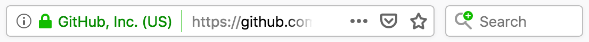

# OpenSearch

  - [OpenSearch \- Wikipedia](https://en.wikipedia.org/wiki/OpenSearch) #ril

## 新手上路 ?? {: #getting-started }

  - [OpenSearch description format \| MDN](https://developer.mozilla.org/en-US/docs/Web/OpenSearch) #ril
      - The OpenSearch description format lets a website DESCRIBE A SEARCH ENGINE FOR ITSELF, so that a browser or other client application can USE that search engine. OpenSearch is supported by (at least) Firefox, Edge, Internet Explorer, Safari, and Chrome. 描述自己的 search engine 怎麼用，讓 browser 可以利用。

        觀察到 Firefox 會在 search box 提示有 search engine 可以加，但 Chrome 只會默默將它列在 Settings > Search engine > Manage search engines > Other search engine 裡。

        

      - Firefox also supports additional features not in the OpenSearch standard, such as search suggestions and the `<SearchForm>` element. This article focuses on creating OpenSearch-compatible search PLUGINs that support these additional Firefox features. 為什麼是 plugin?? 如何通用於各 browser?
      - OpenSearch DESCRIPTION FILES can be ADVERTISED as described in Autodiscovery of search plugins, and can be installed programmatically as described in Adding search engines from web pages. 只有 Firefox 支援用 JavaScript 要求權限安裝 search engine plugin，但通用的方法是提供 description file 讓 browser 知道，有各自的實作讓使用者方便安裝。

  - [Building Digital Libraries, Second Edition \- Kyle Banerjee , Terry Reese, Jr\. \- Google Books](https://books.google.com.tw/books?id=iHCADwAAQBAJ&pg=PA217&lpg=PA217&dq=opensearch+head+profile)

  - [Opensearch \| Building Search UI Guide \| Algolia Documentation](https://www.algolia.com/doc/guides/building-search-ui/resources/ui-and-ux-patterns/in-depth/opensearch/js/) 提到 URL synchronization 的概念 (2018-12-20) #ril

## 應用實例 {: #powered-by }

  - [https://github\.com/opensearch\.xml](https://github.com/opensearch.xml)

        <OpenSearchDescription
            xmlns="http://a9.com/-/spec/opensearch/1.1/"
            xmlns:moz="http://www.mozilla.org/2006/browser/search/">
            <script/>
            <ShortName>GitHub</ShortName>
            <Description>Search GitHub</Description>
            <InputEncoding>UTF-8</InputEncoding>
            <Image width="16" height="16" type="image/x-icon">https://github.com/favicon.ico</Image>
            <Url type="text/html" method="get" template="https://github.com/search?q={searchTerms}&ref=opensearch"/>
            <moz:SearchForm>https://github.com/search</moz:SearchForm>
        </OpenSearchDescription>

## Browser Support ??

  - [Tab to Search \- The Chromium Projects](https://www.chromium.org/tab-to-search)
      - Among the many features Chromium's Omnibox offers is the ability to search a site WITHOUT NAVIGATING TO THE SITES HOMEPAGE. Once Chromium has DETERMINED it can search a site, any time the user types the URL of the site into the Omnibox the user is offered the ability to search the site. Once the user presses TAB, then types in a string and presses the enter, the site is searched and the results shown to the user. 問題就在 Chrome 如何認定 "it can search a site"? 其中 omnibox 唸做 `[‵ɑmnɪbɑks]`，前綴 omni- 有 "全/總/泛" 的意思。
      - Chromium provides two heuristics that automatically add a site to the list of SEARCHABLE sites. ... For 1 and 2 Chromium only adds sites that the user navigated to WITHOUT A PATH. For example `http://mysite.com`, but not `http://mysite.com/foo`. (啟發 Chrome 的方式?) 其一是提供 description document，其二是 HTML form 符合一些條件時，會自動加入；但結果都是 searchable sites。
      - On your site's homepage provide a link to an OpenSearch description document. The link to the OSDD is placed in the head of the html file.

            <head>
             <link type="application/opensearchdescription+xml" rel="search"
                   href="url_of_osdd_file"/>
            </head>

        The important part of this document is the URL used to search your site. The following is an example that contains the bare minimum needed

            <?xml version="1.0"?>
            <OpenSearchDescription xmlns="http://a9.com/-/spec/opensearch/1.1/">
             <ShortName>Search My Site</ShortName>
             <Description>Search My Site</Description>
             <Url type="text/html" method="get" template="http://my_site/{searchTerms}"/>
            </OpenSearchDescription>

        When the user presses enter in the Omnibox the string `{searchTerms}` in the url is replaced with the string the user typed. 然後是 URL 編碼過的

      - You can also include a suggestion service by adding another URL element with rel="suggestions" such as: 

            <Url type="application/json" rel="suggestions" template="http://my_site/suggest?q={searchTerms}" />

        If you include this, the omnibox will use your suggestion service to provide query suggestions based on the user's partial query. 原來不只 Firefox 支援 suggestion。

      - If the site does not provide a link to an OpenSearch description document but the user SUBMITS A FORM, then Chrome AUTOMATICALLY adds the site to the list of searchable sites. There are a number of RESTRICTIONS with this approach though. In particular the form must generate a GET, must result in a HTTP url, and the form must not have `OnSubmit` script. Additionally there must be ONLY ONE input element of type `text`, no passwords, files or text areas and all other input elements must be in their DEFAULT STATE. 難怪 Settings > Search engine > Manage search engines 一堆!!

  - [Quick Website Search - Safari 8\.0](https://developer.apple.com/library/archive/releasenotes/General/WhatsNewInSafari/Articles/Safari_8_0.html) #ril
      - A new feature, Quick Website Search, allows users to access content from a specified website directly from Safari’s SMART SEARCH FIELD, bypassing their normal search engine. For example, a user might type “app solitaire” to search for solitaire games on the App Store, or “wiki OS X Yosemite” to find the Wikipedia article on OS X Yosemite. The desired result would then appear AT THE TOP OF THE SUGGESTED COMPLETION LIST for that search. 實際操作，跟 Chrome 一樣要按 Tab 才會用該 search engine 搜尋；以 GitHub 為例，瀏覽過 github.com 後，Safari > Preferences > Search > Manage Websites... 下面就會多了 github.com，要勾選左側 Enable Quick Website Search 才會自動加入。

  - Firefox 的操作有沒有文件，在 Preferences > Search > Search 採用 Add search bar in toolbar 時，第一次瀏覽 github.com 會出現 "放大鏡與加號"，使用者可以明確把 search engine 加入 #ril

  - [Dev guide \- Search provider discovery \- Microsoft Edge Development \| Microsoft Docs](https://docs.microsoft.com/en-us/microsoft-edge/dev-guide/browser-features/search-provider-discovery) #ril
  - [How to let Google power OpenSearch on your website • Aaron Parecki](https://aaronparecki.com/2011/07/11/3/how-to-let-google-power-opensearch-on-your-website) (2011-07-11) #ril

## Description Document (OSD) ??

  - [OpenSearch description file - OpenSearch description format \| MDN](https://developer.mozilla.org/en-US/docs/Web/OpenSearch#OpenSearch_description_file) #ril
      - The XML file that describes a search engine follows the basic template below. Sections in [square brackets] should be customized for the specific plugin you're writing.

            <OpenSearchDescription xmlns="http://a9.com/-/spec/opensearch/1.1/"
                                   xmlns:moz="http://www.mozilla.org/2006/browser/search/"> <-- moz namespace 用在 <SearchForm>
              <ShortName>[SNK]</ShortName>
              <Description>[Search engine full name and summary]</Description>
              <InputEncoding>[UTF-8]</InputEncoding>
              <Image width="16" height="16" type="image/x-icon">[https://example.com/favicon.ico]</Image>
              <Url type="text/html" template="[searchURL]">
                <Param name="[key name]" value="{searchTerms}"/>
                <!-- other Params if you need them… -->
                <Param name="[other key name]" value="[parameter value]"/>
              </Url>
              <Url type="application/x-suggestions+json" template="[suggestionURL]"/> <-- 以下是 Firefox 特有的
              <moz:SearchForm>[https://example.com/search]</moz:SearchForm>
            </OpenSearchDescription>

      - `ShortName` - A short name for the search engine. It must be 16 or fewer characters of plain text, with no HTML or other markup.
      - `Description` - A brief description of the search engine. It must be 1024 or fewer characters of plain text, with no HTML or other markup.
      - `InputEncoding` - The character encoding to use when submitting input to the search engine.
      - `Image` - URI of an icon for the search engine. When possible, include a 16×16 image of type `image/x-icon` (such as `/favicon.ico`) and a 64×64 image of type `image/jpeg` or `image/png`. The URI may also use the `data:` URI scheme. 可以多個??

            <Image height="16" width="16" type="image/x-icon">https://example.com/favicon.ico</Image>
              <!-- or -->
            <Image height="16" width="16">data:image/x-icon;base64,AAABAAEAEBAAA … DAAA=</Image>

      - `Url` - Describes the URL or URLs to use for the search. The `template` attribute indicates the base URL for the search query.

        Firefox supports three URL types: (後 2 個 URL type 其他 browser 都不支援)

          - `type="text/html"` - specifies the URL for the actual search query.
          - `type="application/x-suggestions+json"` specifies the URL for fetching search suggestions. In Firefox 63 onwards, `type="application/json"` is accepted as an alias of this.
          - `type="application/x-moz-keywordsearch"` specifies the URL used when a keyword search is entered in the LOCATION BAR. This is supported only in Firefox.

        For these URL types, you can use `{searchTerms}` to substitute the search terms entered by the user in the search bar or location bar. Other supported DYNAMIC search parameters are described in OpenSearch 1.1 parameters. 其中 location bar 跟 search bar 有什麼不同?? Chrome 並沒有像 Firefox 這樣區分

      - `Param` - The parameters that must be passed in along with the search query as key/value pairs. When specifying values, you can use `{searchTerms}` to insert the search terms entered by the user in the search bar.

      - `moz:SearchForm` - The URL for the site's search page for which the plugin. This lets Firefox users visit the web site directly.

        Since this element is Firefox-specific, and not part of the OpenSearch specification, we use the `moz:` XML namespace prefix in the example above to ensure that other user agents that don't support this element can SAFELY IGNORE IT.

  - [opensearch/opensearch\-1\-1\-draft\-6\.md at master · dewitt/opensearch](https://github.com/dewitt/opensearch/blob/master/opensearch-1-1-draft-6.md) #ril

## 參考資料

  - [OpenSearch.org](http://www.opensearch.org/Home)
  - [dewitt/opensearch - GitHub](https://github.com/dewitt/opensearch)

社群：

  - ['opensearch' Questions - Stack Overflow](https://stackoverflow.com/questions/tagged/opensearch)

工具：

  - [OpenSearch plugin generator](http://7is7.com/software/firefox/opensearch.html) - 產生 description file，支持 Firefox 特有功能
  - [Ready2Search](http://ready.to/search/en/) - 產生 description file

手冊：

  - [OpenSearch 1.1 Draft 6](https://github.com/dewitt/opensearch/blob/master/opensearch-1-1-draft-6.md)